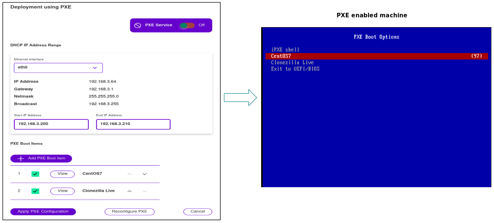

# About EasyPXE 
EasyPXE simplifies PXE network boot process for OS deployment.
It reduces manual effort in setting up PXE services required for network-boot based OS deployment. The web-UI takes minimal inputs from the user and discovers most of the network settings automatically to configure the tool for PXE net-boot.

The tool is compatible with custom OS images created for optical media or USB media based OS deployment, making it easy to switch to network based OS deployment.

EasyPXE is a versatile tool supporting multiple formats of custom OS images. Refer to the "Supported OS Images" section for more details.

The tool can be installed on a Linux VM running in a Laptop or a server.

**Features**

- Intuitive Web-UI simplifies PXE services setup processes.
- Install OS using PXE booting on PC's, Servers, Point-of-Sale machines, any PXE enabled device.
- Supports network booting of RHEL, CentOS, Windows 10, Windows Server and [Clonezilla Live](https://clonezilla.org/).
- Support for bootable WinPE images for Windows 10 and Windows Server.
- Support for Windows 10 custom images created using MDT/LiteTouch.
- Enabled by [Clonezilla Live](https://clonezilla.org/), backup and restore the client devices directly using EasyPXE server internal storage.
- Easily create multiple boot menu entries in the PXE boot screen.
- Serves iPXE for fast loading of boot images and packages over network using HTTP which is much faster compared to TFTP.
- Supports UEFI as well as Legacy BIOS on client devices.
- Internal DHCP service can be enabled optionally when there is no DHCP available in the LAN.
- Works with existing DHCP service in the LAN.

**Internal Components**
- dnsmasq (DNS masquerade) for PXE, TFTP and DHCP.
- iPXE for networking booting.
- Samba - for sharing additional packages for Windows installation and storing Clonezilla cloning.
- NGINX - for web-UI.

### Configuring PXE Boot Menu Entries using Web-UI
The PXE Boot menu items for different OS installations can be easily added using Web-UI.

Sources at [Github](https://github.com/avirgvd/easypxe)

